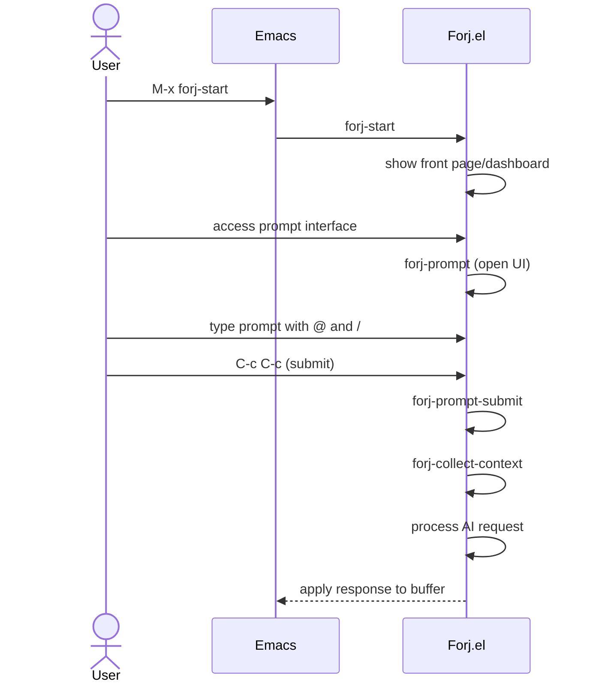

# Specification 002: Emacs-Native Context Management System

## 1. Overview

### Purpose

Design and implement a comprehensive context management system that leverages native Emacs concepts (buffers, regions, marks, compilation results, Dired) to provide intelligent, contextual AI assistance within the Forj.el framework.

### Goals

- **Emacs Integration**: Use familiar Emacs concepts for context collection and management
- **Intelligent Context**: Automatically suggest relevant context based on prompt analysis and current Emacs state
- **Smart Context**: Automatically manage context based on current work
- **Visual Feedback**: Provide clear visual indicators for selected context and context relevance
- **Performance**: Efficient context collection and storage with minimal impact on Emacs responsiveness

### Success Criteria

- Context collection feels natural to Emacs users
- AI responses are more accurate due to better context
- Context management doesn't interfere with normal Emacs workflows
- Performance impact < 100ms for context operations

### Architectural Change: Entry Points

- **Application launcher**: `forj-start` is the main application entry point (like typing 'claude' in the command line). This opens the Forj front page/dashboard where users can access different features and see application status.
- **Interactive prompt interface**: `forj-prompt` opens the interactive prompt UI with context management, `@` file selection, and `/` command selection functionality. This is the dedicated interface for AI interactions.
- **AI processing**: The actual AI request handling continues to use the existing `forj-prompt` function for processing prompts with context, but this is now separated from the UI opening functionality.



## 2. Context Collection Strategies

### 2.1 Buffer-Centric Context

```elisp
;; Core context collection from buffers
(defun forj-collect-buffer-context (buffer-or-name &optional region)
  "Collect context from buffer, optionally limited to region.")

;; Multi-buffer context collection
(defun forj-collect-context-from-buffers (buffer-list)
  "Collect context from multiple buffers with relevance scoring.")
```

**Context Sources:**

- **Active Buffer**: Current buffer content with syntax highlighting awareness
- **Buffer Selection**: Multiple buffers via `C-u` prefix or buffer selection interface
- **Region Context**: Selected text regions with surrounding context
- **Mark Ring**: Recently marked locations with context preservation
- **Window Configuration**: Multi-window layouts with buffer relationships

### 2.2 File System Context

```elisp
;; Project-wide context collection
(defun forj-collect-project-context (project-root &optional file-patterns)
  "Collect context from entire project with filtering.")

;; File context collection
(defun forj-collect-file-context (file-path)
  "Collect context from a specific file.")
```

**Context Sources:**

- **Project Files**: Automatically detect and include relevant project files
- **File Relationships**: Include imported/required files and dependencies
- **Directory Structure**: Project layout and organization context

### 2.3 Development Context

```elisp
;; Compilation and error context
(defun forj-collect-compilation-context (&optional include-warnings)
  "Collect context from compilation buffer and error locations.")

;; Version control context
(defun forj-collect-vc-context (&optional include-history)
  "Collect context from version control status and changes.")
```

**Context Sources:**

- **Compilation Results**: Error messages, warnings, and build output
- **Version Control**: Git status, diffs, recent commits
- **LSP Integration**: Language server diagnostics and symbol information
- **REPL History**: Interactive development session context

## 3. Smart Context Suggestions

### 3.1 Prompt Analysis Engine

```elisp
;; Analyze user prompts for context requirements
(defun forj-analyze-prompt-for-context (prompt)
  "Analyze prompt and suggest relevant context sources."
  (let ((context-suggestions '()))
    ;; File mention analysis
    (when (string-match-p "\\b\\w+\\.\\w+\\b" prompt)
      (push '(:type file :confidence 0.9) context-suggestions))
    ;; Error/debugging keywords
    (when (string-match-p "\\b\\(error\\|debug\\|fix\\|broken\\)\\b" prompt)
      (push '(:type compilation :confidence 0.8) context-suggestions))
    context-suggestions))
```

**Analysis Categories:**

- **File References**: Detect file names, extensions, and paths in prompts
- **Code Keywords**: Identify programming language constructs and patterns
- **Error Keywords**: Recognize debugging and troubleshooting requests
- **Project Keywords**: Detect project-wide operations and architectural requests

### 3.2 Emacs State Analysis

```elisp
;; Analyze current Emacs state for context relevance
(defun forj-analyze-emacs-state ()
  "Analyze current Emacs state and suggest relevant context."
  (list
   :active-buffer (current-buffer)
   :buffer-mode major-mode
   :region-active (use-region-p)
   :compilation-buffer (get-buffer "*compilation*")
   :project-files (when (project-current)
                   (project-files (project-current)))))
```

**State Indicators:**

- **Major Mode**: Context suggestions based on programming language or mode
- **Active Region**: Include selected text as high-priority context
- **Open Buffers**: Suggest related buffers based on content similarity
- **Recent Files**: Include recently accessed files in context suggestions

## 4. Context Management Interface

### 4.1 Pop-up Buffer Interface

The new Forj.el interaction interface replaces minibuffer prompts with a dedicated pop-up buffer.

**Key Bindings:**

- Launch Forj application via `M-x forj-start` (opens front page/dashboard)
- From the front page, users can access the prompt interface via `forj-prompt`
- Within the prompt interface:
  - `@` → Minibuffer file selection, inserts file path into prompt
  - `/` → Minibuffer command selection, inserts command into prompt
  - `C-c C-c` → Submit prompt (processes AI request with context)
  - `C-c C-k` → Cancel and close prompt buffer

### 4.2 ASCII Wireframe - Forj Prompt Interface

```
┌─ *Forj Prompt* ───────────────────────────────────── [C-c C-c: Submit | C-c C-k: Cancel] ─┐
│                                                                                            │
│ > Your prompt goes here...                                                                 │
│                                                                                            │
└────────────────────────────────────────────────────────────────────────────────────────────┘
```

### 4.5 Integration Flow

**Workflow:**

1. User launches Forj application via `M-x forj-start`.
2. Forj front page/dashboard opens, showing application status and available features.
3. User accesses the prompt interface (via `forj-prompt` command or interface element).
4. Interactive prompt buffer opens with context management capabilities.
5. User types prompt, and can optionally:
   - Type `@` to trigger minibuffer file selection. The selected file path is inserted into the prompt.
   - Type `/` to trigger minibuffer command selection. The selected command is inserted into the prompt.
6. User submits with `C-c C-c`.
7. Context is collected automatically based on prompt analysis and Emacs state.
8. AI request is processed with enhanced context.
9. Response is inserted directly into the original buffer, at the point where the command was initially invoked.

## 5. Implementation Architecture

### 5.1 Core Context System

```elisp
(defgroup forj-context nil
  "Context management system for Forj.el"
  :group 'forj
  :prefix "forj-context-")

(defcustom forj-context-max-size 50000
  "Maximum size of context in characters."
  :type 'integer
  :group 'forj-context)

(defcustom forj-context-auto-suggestions t
  "Enable automatic context suggestions based on prompt analysis."
  :type 'boolean
  :group 'forj-context)

(defvar forj-context-selected '()
  "Currently selected context items.")
```

### 5.2 Context Collection Functions

```elisp
;; Main context collection interface
(defun forj-collect-context (&optional sources)
  "Collect context from specified sources or auto-detect."
  (interactive)
  (let ((context-data '()))
    (dolist (source (or sources (forj-suggest-context-sources)))
      (pcase (plist-get source :type)
        ('buffer (push (forj-collect-buffer-context
                       (plist-get source :buffer)
                       (plist-get source :region)) context-data))
        ('file (push (forj-collect-file-context
                     (plist-get source :path)) context-data))
        ('compilation (push (forj-collect-compilation-context) context-data))))
    (forj-optimize-context-size context-data)))

;; Buffer context collection
(defun forj-collect-buffer-context (buffer &optional region)
  "Collect context from buffer with optional region focus."
  (with-current-buffer buffer
    (let* ((content (if region
                       (buffer-substring-no-properties
                        (car region) (cdr region))
                     (buffer-string)))
           (buffer-info (list :buffer (buffer-name)
                             :mode major-mode
                             :size (buffer-size)
                             :modified (buffer-modified-p))))
      `(:type buffer
        :content ,content
        :metadata ,buffer-info
        :relevance ,(forj-calculate-buffer-relevance buffer)))))

;; File context collection
(defun forj-collect-file-context (file-path)
  "Collect context from a specific file."
  (when (file-exists-p file-path)
    `(:type file
      :path ,file-path
      :content ,(forj-read-file-safely file-path 2000)
      :relevance ,(forj-calculate-file-relevance file-path))))

;; Smart context suggestions
(defun forj-suggest-context-sources (&optional prompt)
  "Suggest relevant context sources based on prompt and Emacs state."
  (let ((suggestions '())
        (prompt (or prompt "")))
    ;; Analyze current buffer
    (when (buffer-file-name)
      (push `(:type buffer
              :buffer ,(current-buffer)
              :relevance 0.9
              :reason "Current active buffer") suggestions))

    ;; Check for compilation buffer
    (when (get-buffer "*compilation*")
      (with-current-buffer "*compilation*"
        (unless (= (point-min) (point-max))
          (push `(:type compilation
                  :relevance 0.8
                  :reason "Recent compilation output") suggestions))))

    ;; Analyze prompt for file references
    (when (string-match "\b\([a-zA-Z0-9._-]+\\.\w+\)\b" prompt)
      (let ((filename (match-string 1 prompt)))
        (when (file-exists-p filename)
          (push `(:type file
                  :path ,filename
                  :relevance 0.95
                  :reason ,(format "File mentioned in prompt: %s" filename))
                suggestions))))

    (nreverse suggestions)))
```

### 5.3 Prompt Buffer Interface

```elisp
;; Main entry point for the Forj.el UI
(defun forj-start ()
  "Open Forj prompt buffer for AI assistance."
  (interactive)
  (let ((buffer (get-buffer-create "*Forj Prompt*")))
    (with-current-buffer buffer
      (forj-prompt-mode)
      (forj-setup-prompt-buffer)
      (goto-char (point-min)))
    (pop-to-buffer buffer)
    (message "Type your request. Use C-c C-c to submit")))

;; Prompt mode with special key handling
(define-derived-mode forj-prompt-mode text-mode "Forj-Prompt"
  "Major mode for Forj AI prompt interface."
  (setq-local fill-column 80)
  (setq-local header-line-format
              "Forj Prompt: C-c C-c Submit | C-c C-k Cancel")

  ;; Initialize context management

  ;; Enable syntax highlighting for code blocks
  (font-lock-mode 1))

;; Key bindings for prompt mode
(define-key forj-prompt-mode-map (kbd "C-c C-c") #'forj-prompt-submit)
(define-key forj-prompt-mode-map (kbd "C-c C-k") #'forj-prompt-cancel)

;; Setup prompt buffer layout
(defun forj-setup-prompt-buffer ()
  "Initialize the prompt buffer."
  (erase-buffer)

  ;; Main prompt area
  (insert "\n\n")
  (goto-char (point-min)))


;; Context selection interface

;; Submit prompt
(defun forj-prompt-submit ()
  "Submit the prompt buffer content."
  (interactive)
  (let* ((content (buffer-substring-no-properties
                   (point-min)
                   (save-excursion
                     (goto-char (point-min))
                     (search-forward (make-string 80 ?─) nil t)
                     (line-beginning-position))))
         (context '())
         (prompt (string-trim content)))

    (when (string-empty-p prompt)
      (user-error "Please enter a request"))

    ;; Close prompt buffer
    (quit-window t)

    ;; Process request with context
    (forj-prompt prompt)))

;; Cancel prompt
(defun forj-prompt-cancel ()
  "Cancel and close the prompt buffer."
  (interactive)
  (quit-window t)
  (message "Forj prompt cancelled"))
```

### 5.3 Application Interface

```elisp
;; Main application launcher - opens front page/dashboard
(defun forj-start ()
  "Launch Forj application with front page/dashboard."
  (interactive)
  (let ((buffer (get-buffer-create "*Forj*")))
    (with-current-buffer buffer
      (forj-main-mode)
      (forj-setup-front-page)
      (goto-char (point-min)))
    (pop-to-buffer buffer)
    (message "Forj application started. Access prompt interface with 'p' or M-x forj-prompt")))

;; Interactive prompt interface - opens prompt UI with @ and / functionality
(defun forj-prompt ()
  "Open Forj interactive prompt buffer with context management."
  (interactive)
  (let ((buffer (get-buffer-create "*Forj Prompt*")))
    (with-current-buffer buffer
      (forj-prompt-mode)
      (forj-setup-prompt-buffer)
      (goto-char (point-min)))
    (pop-to-buffer buffer)
    (message "Type your request. Use @ for files, / for commands, C-c C-c to submit")))

;; Main application mode
(define-derived-mode forj-main-mode special-mode "Forj"
  "Major mode for Forj application front page."
  (setq-local header-line-format "Forj Application - Press 'p' for prompt, 'q' to quit")
  (setq-local buffer-read-only t))

;; Prompt mode with special key handling
(define-derived-mode forj-prompt-mode text-mode "Forj-Prompt"
  "Major mode for Forj AI prompt interface."
  (setq-local fill-column 80)
  (setq-local header-line-format
              "Forj Prompt: C-c C-c Submit | C-c C-k Cancel")

  ;; Initialize context management

  ;; Enable syntax highlighting for code blocks
  (font-lock-mode 1))

;; Key bindings for prompt mode
(define-key forj-prompt-mode-map (kbd "C-c C-c") #'forj-prompt-submit)
(define-key forj-prompt-mode-map (kbd "C-c C-k") #'forj-prompt-cancel)
(define-key forj-prompt-mode-map (kbd "@") #'forj-insert-file)
(define-key forj-prompt-mode-map (kbd "/") #'forj-insert-command)

;; Setup front page layout
(defun forj-setup-front-page ()
  "Initialize the Forj front page/dashboard."
  (erase-buffer)
  (insert "Forj.el - AI Assistant for Emacs\n\n")
  (insert "Available Commands:\n")
  (insert "  p - Open prompt interface\n")
  (insert "  q - Quit application\n\n")
  (insert "Status: Ready\n")
  (goto-char (point-min)))

;; Setup prompt buffer layout
(defun forj-setup-prompt-buffer ()
  "Initialize the prompt buffer."
  (erase-buffer)

  ;; Main prompt area
  (insert "\n\n")
  (goto-char (point-min)))

;; Submit prompt
(defun forj-prompt-submit ()
  "Submit the prompt buffer content."
  (interactive)
  (let* ((content (buffer-substring-no-properties (point-min) (point-max)))
         (context '())
         (prompt (string-trim content)))

    (when (string-empty-p prompt)
      (user-error "Please enter a request"))

    ;; Close prompt buffer
    (quit-window t)

    ;; Process request with context - this calls the AI processing function
    (forj-process-prompt prompt)))

;; Cancel prompt
(defun forj-prompt-cancel ()
  "Cancel and close the prompt buffer."
  (interactive)
  (quit-window t)
  (message "Forj prompt cancelled"))
```

## 6. Integration with Existing Forj.el Components

### 6.1 Forj-API Integration

```elisp
;; Update API calls to include context
(defun forj-api-request-with-context (prompt context)
  "Send API request with structured context included."
  (let* ((context-summary (forj-format-context-for-api context))
         (enhanced-prompt (format "Context:\n%s\n\nUser Request:\n%s"
                                 context-summary prompt)))
    (forj-api-request enhanced-prompt)))

(defun forj-format-context-for-api (context-list)
  "Format context list for API consumption."
  (mapconcat
   (lambda (ctx)
     (let ((type (plist-get ctx :type))
           (content (plist-get ctx :content))
           (metadata (plist-get ctx :metadata)))
       (format "=== %s Context ===\n%s\n"
               (capitalize (symbol-name type))
               (if (> (length content) 2000)
                   (concat (substring content 0 2000) "\n[... truncated ...]")
                 content))))
   context-list
   "\n"))
```

### 6.2 Error System Integration

```elisp
;; Integrate with centralized error handling
(defun forj-context-error (message &rest args)
  "Report context-related errors through centralized system."
  (apply #'forj-user-error
         (format "Context Error: %s" message)
         :context "Context Management"
         :recovery '("Check context sources are accessible"
                    "Verify file permissions"
                    "Try reducing context size")
         args))

;; Context validation
(defun forj-validate-context (context-list)
  "Validate context data and report issues."
  (let ((total-size 0)
        (errors '()))
    (dolist (ctx context-list)
      (let ((content (plist-get ctx :content)))
        (unless content
          (push "Context item missing content" errors))
        (incf total-size (length content))))

    (when (> total-size forj-context-max-size)
      (forj-context-error "Context size (%d) exceeds maximum (%d)"
                         total-size forj-context-max-size))

    (when errors
      (forj-context-error "Context validation failed: %s"
                         (string-join errors ", ")))

    t))
```

## 7. Performance Optimization

### 7.1 Lazy Loading and Caching

```elisp
;; Content caching to avoid repeated file reads
(defvar forj-context-content-cache (make-hash-table :test 'equal)
  "Cache for context content to avoid repeated reads.")

(defun forj-get-cached-content (source)
  "Get cached content or read and cache it."
  (let* ((cache-key (format "%s:%s" (plist-get source :type)
                           (or (plist-get source :path)
                               (plist-get source :buffer))))
         (cached (gethash cache-key forj-context-content-cache)))
    (if cached
        cached
      (let ((content (forj-read-context-source source)))
        (puthash cache-key content forj-context-content-cache)
        content))))

;; Async context collection for large sources
(defun forj-collect-context-async (sources callback)
  "Collect context asynchronously to avoid blocking."
  (let ((results '())
        (pending (length sources)))
    (dolist (source sources)
      (run-with-timer
       0 nil
       (lambda ()
         (let ((context (forj-collect-single-context source)))
           (push context results)
           (decf pending)
           (when (zerop pending)
             (funcall callback (nreverse results)))))))))
```

### 7.2 Context Size Management

```elisp
;; Smart truncation to stay within size limits
(defun forj-optimize-context-size (context-list)
  "Optimize context list to fit within size constraints."
  (let ((total-size 0)
        (optimized '()))

    ;; Sort by relevance, keep highest relevance items
    (setq context-list (sort context-list
                           (lambda (a b)
                             (> (plist-get a :relevance)
                                (plist-get b :relevance)))))

    (dolist (ctx context-list)
      (let* ((content (plist-get ctx :content))
             (size (length content)))
        (when (< (+ total-size size) forj-context-max-size)
          (push ctx optimized)
          (incf total-size size))))

    (nreverse optimized)))

;; Content summarization for large files
(defun forj-summarize-large-content (content max-size)
  "Summarize content that exceeds size limit."
  (if (<= (length content) max-size)
      content
    (let* ((chunk-size (/ max-size 3))
           (start (substring content 0 chunk-size))
           (end (substring content (- (length content) chunk-size))))
      (format "%s\n\n[... %d characters truncated ...]\n\n%s"
              start
              (- (length content) (* 2 chunk-size))
              end))))
```

## 8. Testing and Validation

### 8.1 Context Collection Tests

```elisp
(ert-deftest forj-test-buffer-context-collection ()
  "Test buffer context collection functionality."
  (with-temp-buffer
    (insert "function test() {\n  return 'hello';\n}")
    (js-mode)
    (let ((context (forj-collect-buffer-context (current-buffer))))
      (should (plist-get context :content))
      (should (eq (plist-get (plist-get context :metadata) :mode) 'js-mode))
      (should (> (plist-get context :relevance) 0)))))

(ert-deftest forj-test-context-size-optimization ()
  "Test context size optimization."
  (let ((large-context (list
                       `(:content ,(make-string 30000 ?x) :relevance 0.9)
                       `(:content ,(make-string 25000 ?y) :relevance 0.8)
                       `(:content ,(make-string 10000 ?z) :relevance 0.7)))
        (forj-context-max-size 40000))
    (let ((optimized (forj-optimize-context-size large-context)))
      (should (< (apply #'+ (mapcar (lambda (ctx)
                                    (length (plist-get ctx :content)))
                                  optimized))
                forj-context-max-size)))))

(ert-deftest forj-test-smart-suggestions ()
  "Test smart context suggestions."
  (let ((forj-context-auto-suggestions t))
    (with-temp-buffer
      (insert "Fix the auth.js file")
      (let ((suggestions (forj-suggest-context-sources
                         "Fix the auth.js file")))
        (should suggestions)
        (should (seq-some (lambda (s)
                          (string-match-p "auth.js"
                                        (plist-get s :reason)))
                        suggestions))))))
```

### 8.2 Integration Tests

```elisp
(ert-deftest forj-test-api-context-integration ()
  "Test API integration with context."
  (let ((mock-context (list `(:type buffer
                             :content "function test() { return true; }"
                             :metadata (:buffer "test.js" :mode js-mode))))
        (mock-prompt "Fix this function"))
    (let ((formatted (forj-format-context-for-api mock-context)))
      (should (string-match-p "=== Buffer Context ===" formatted))
      (should (string-match-p "function test()" formatted)))))

(ert-deftest forj-test-file-context-collection ()
  "Test file context collection functionality."
  (let ((temp-file (make-temp-file "forj-test" nil ".js")))
    (unwind-protect
        (progn
          (write-region "function test() { return true; }" nil temp-file)
          (let ((context (forj-collect-file-context temp-file)))
            (should context)
            (should (plist-get context :content))
            (should (string-match-p "function test" (plist-get context :content)))))
      (delete-file temp-file))))
```

## 9. Documentation and User Guide

### 9.1 User Documentation

The context management system should be documented with:

- **Quick Start Guide**: Basic context selection workflows
- **Advanced Usage**: Context optimization and performance tuning
- **Integration Guide**: Using context with different Emacs workflows
- **Troubleshooting**: Common issues and performance optimization
- **API Reference**: Functions and variables for customization

### 9.2 Developer Documentation

- **Architecture Overview**: System design and component interactions
- **Extension Guide**: Adding new context source types
- **Performance Guide**: Optimization strategies and benchmarking
- **Testing Guide**: Writing tests for context functionality

## 10. Future Enhancements

### 10.1 Advanced Features

- **Semantic Context**: Use LSP and treesitter for semantic code context
- **Context Learning**: ML-based relevance scoring based on user feedback
- **Remote Context**: Support for remote files and distributed development
- **Visual Context**: Screenshots and diagrams as context sources

### 10.2 Integration Expansion

- **Org-mode Integration**: Use Org files and agenda as context sources
- **Magit Integration**: Enhanced Git context with commit and branch history
- **Projectile Integration**: Project-aware context suggestions
- **Company/Ivy Integration**: Context-aware completion and search

This specification provides a comprehensive foundation for implementing an Emacs-native context management system that leverages familiar Emacs concepts while providing intelligent, contextual AI assistance within the Forj.el framework.
